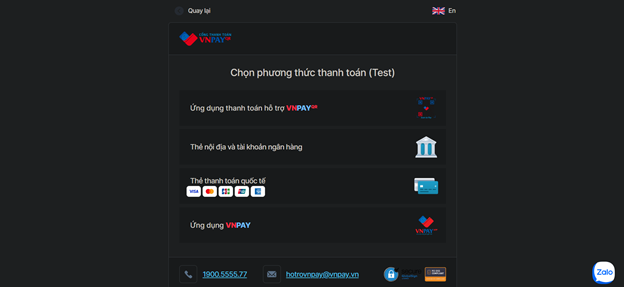
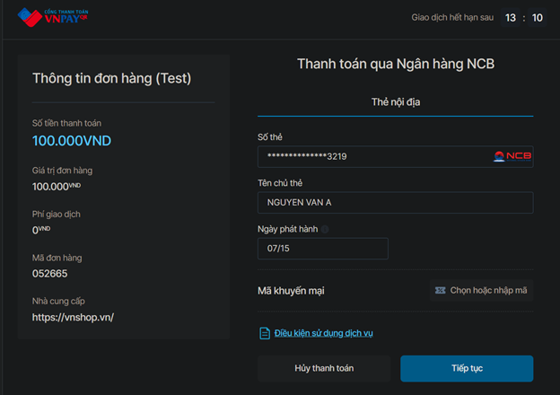
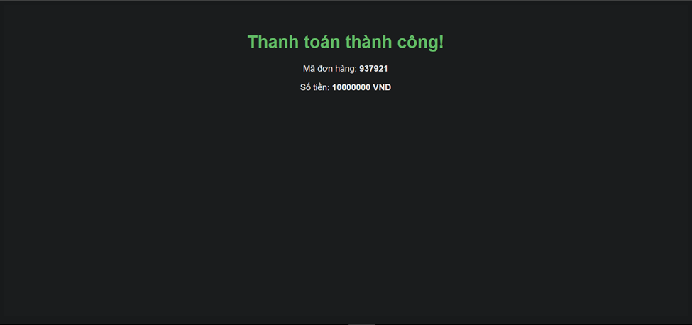

# Spring Payment API

## Overview

Spring Payment API là một dự án Spring Boot cung cấp các REST API để quản lý đơn hàng (Orders) và thanh toán (Payments), bao gồm cả tích hợp thanh toán VNPay.

Spring Payment API is a Spring Boot project providing REST APIs for managing Orders and Payments, including VNPay payment integration.

---

## Getting Started

### Prerequisites

- Java 17+
- Maven (hoặc sử dụng script `mvnw` đi kèm / or use the included `mvnw` script)

### Run the Application

```sh
./mvnw spring-boot:run
```

hoặc / or

```sh
mvn spring-boot:run
```

Ứng dụng sẽ chạy tại / The application will run at:  
[http://localhost:8080](http://localhost:8080)

---

## API Documentation

### Orders

- **Create Order**
  - `POST /api/orders`
  - Request body:
    ```json
    {
      "customerName": "John Doe",
      "customerEmail": "john.doe@example.com",
      "amount": 299.99,
      "currency": "USD"
    }
    ```
- **Get Order By ID**
  - `GET /api/orders/{id}`

### Payments

- **Process Bank Payment**
  - `POST /api/payments`
  - Request body:
    ```json
    {
      "orderId": 1,
      "paymentMethod": "BANK",
      "bankName": "Example Bank",
      "accountNumber": "12345678"
    }
    ```
- **Process Cash Payment**
  - `POST /api/payments`
  - Request body:
    ```json
    {
      "orderId": 1,
      "paymentMethod": "CASH",
      "receiptNumber": "RCPT-123456"
    }
    ```
- **Get Payment By ID**

  - `GET /api/payments/{paymentId}`

- **Get Payments By Order ID**

  - `GET /api/payments/order/{orderId}`

- **Update Payment Status**
  - `PATCH /api/payments/{paymentId}/status?status=COMPLETED`

---

## VNPay Payment Integration / Tích hợp thanh toán VNPay

### 1. Cấu hình / Configuration

Thêm các thông tin sau vào `src/main/resources/application.properties`:

```
vnpay.tmnCode=YOUR_TMN_CODE
vnpay.hashSecret=YOUR_HASH_SECRET
vnpay.payUrl=https://sandbox.vnpayment.vn/paymentv2/vpcpay.html
vnpay.returnUrl=http://localhost:8080/api/payments/vnpay-payment
vnpay.apiUrl=https://sandbox.vnpayment.vn/merchant_webapi/api/transaction
```

Thay `YOUR_TMN_CODE` và `YOUR_HASH_SECRET` bằng thông tin sandbox của bạn.  
Replace `YOUR_TMN_CODE` and `YOUR_HASH_SECRET` with your sandbox credentials.

### 2. API Thanh toán VNPay / VNPay Payment API

- **Tạo URL thanh toán / Create payment URL**
  - `POST /api/payments/create-payment`
  - Request body:
    ```json
    {
      "amount": 100000,
      "orderInfo": "Thanh toan don hang #123"
    }
    ```
  - Response: URL thanh toán VNPay (redirect user tới URL này) / VNPay payment URL (redirect user to this URL)


    

    
    
- **Callback kết quả thanh toán / Payment callback**
  - `GET /api/payments/vnpay-payment`
  - VNPay sẽ redirect về endpoint này sau khi thanh toán (thành công/thất bại).  
    VNPay will redirect to this endpoint after payment (success/failure).
  - Response: Trang HTML thông báo kết quả / HTML page showing payment result.
    

### 3. Hướng dẫn test với Postman / Test with Postman

- Import file `postman_collection.json` vào Postman để thử các API mẫu.  
  Import the `postman_collection.json` file into Postman to try sample APIs.
- Gửi request `POST /api/payments/create-payment` với body JSON như trên.  
  Send `POST /api/payments/create-payment` with the JSON body above.
- Lấy URL trả về, mở trên trình duyệt để test thanh toán.  
  Copy the returned URL and open it in your browser to test payment.

---

## Notes

- Ứng dụng sử dụng H2 (in-memory) database mặc định, dữ liệu sẽ mất khi tắt ứng dụng.  
  The application uses H2 (in-memory) database by default, data will be lost when the app stops.
- Để tự động reload khi thay đổi code, bạn có thể thêm Spring Boot DevTools vào project.  
  To enable auto-reload on code changes, add Spring Boot DevTools to your project.
